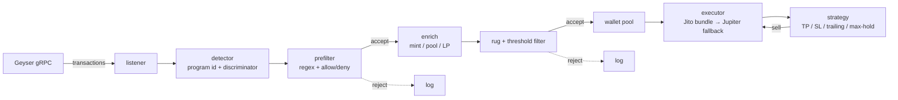

# solana-nova-sniper

A high-performance Solana token sniper written in Rust that watches a
Yellowstone / Helius Geyser gRPC stream for new token launches on
**Pump.fun** and **Raydium LaunchLab**, runs rug / custom filters against
each candidate, and executes buys through **Jito bundles** with a Jupiter
fallback. Exits are driven by a configurable TP / SL / trailing-stop state
machine.

> **Read the [risk disclaimer](#risk-disclaimer) before you do anything
> with real funds.** This software will lose money by default. It is
> published as an educational reference for building real-time Solana
> infrastructure, not as financial advice.

---

## Feature summary

- Real-time Yellowstone / Helius Geyser gRPC subscription with automatic
  reconnect and exponential backoff.
- Program-id + instruction-discriminator based launch detection for
  Pump.fun `create` and Raydium LaunchLab `initialize`. Inner (CPI)
  instructions are walked too.
- Composable filter pipeline: min liquidity, max supply, dev allow/deny,
  name/symbol regex, required socials.
- Rug checks: mint authority renounced, freeze authority null, LP locked /
  burned percentage threshold.
- Jito bundle submission with configurable tip, random tip-account
  selection, and bounded retries. Falls back to plain RPC send if all
  bundle attempts are dropped.
- Exit state machine: TP ladder, hard stop-loss, trailing stop armed at
  configurable multiplier, max-hold timeout.
- Multi-wallet pool with round-robin / random / first-available rotation.
- `--simulate` dry-run mode that logs what *would* be sniped without
  signing anything.
- Structured JSON tracing for production observability.
- Unit tests for filters and the strategy state machine. Criterion
  benchmarks for the CPU-bound hot path (decode → filter → strategy).

---

## Flow



---

## Project layout

```
solana-nova-sniper/
├── Cargo.toml
├── config.example.toml
├── README.md
├── src/
│   ├── lib.rs          # module exports + bench_api
│   ├── main.rs         # CLI, config load, graceful shutdown
│   ├── config.rs       # TOML config types + validation
│   ├── listener.rs     # Yellowstone gRPC subscription
│   ├── detector.rs     # launch detection + instruction decoding
│   ├── filters.rs      # prefilter + full rug/threshold evaluation
│   ├── executor.rs     # Jito bundle builder + Jupiter fallback
│   ├── strategy.rs     # TP / SL / trailing state machine
│   └── wallet.rs       # multi-wallet rotating pool
└── benches/
    └── latency.rs      # criterion benches for the hot path
```

---

## Setup

### Prerequisites

- Rust `>= 1.75` (stable).
- A Solana RPC endpoint with reasonable rate limits (Helius / Triton /
  your own validator).
- A Yellowstone / Helius Geyser gRPC endpoint. Public Solana RPC does
  **not** expose Geyser — you need a dedicated provider or self-hosted
  node with the Yellowstone plugin.
- A Jito block-engine endpoint URL.
- One or more funded Solana wallets exported as CLI keypair JSON files
  (`solana-keygen new -o ./wallets/wallet-1.json`).

### Build

```bash
cargo build --release
```

The release binary is at `target/release/nova-sniper`.

### Configure

```bash
cp config.example.toml config.toml
$EDITOR config.toml
```

At minimum: set `rpc.http_url`, `rpc.geyser_url`, `jito.block_engine_url`,
and point `wallets.keypair_paths` at your funded keypair files.

### Run in simulate mode first

```bash
./target/release/nova-sniper --config config.toml --simulate
```

Simulate mode subscribes to the stream and logs every launch it would
buy, but never signs or submits a transaction. **Always run simulate
mode for a few hours before going live** — it's the cheapest way to
validate your filters catch the tokens you actually want.

### Run live

```bash
./target/release/nova-sniper --config config.toml
```

### Logs

Tracing is set up to emit JSON by default when `runtime.json_logs = true`.
Set the `RUST_LOG` env var to override the level (e.g.
`RUST_LOG=nova_sniper=debug,yellowstone_grpc_client=warn`).

---

## Config reference

All keys are documented in `config.example.toml`. Highlights:

| Section | Key | Purpose |
|---|---|---|
| `runtime` | `log_level` / `json_logs` / `max_concurrent_snipes` | observability and concurrency |
| `rpc` | `http_url` / `geyser_url` / `geyser_x_token` / `commitment` | RPC endpoints |
| `jito` | `block_engine_url` / `tip_sol` / `tip_accounts` / `max_bundle_retries` | bundle submission |
| `wallets` | `keypair_paths` / `rotation` | multi-wallet pool |
| `sizing` | `buy_sol` / `max_slippage_bps` / `compute_unit_price` / `compute_unit_limit` | per-trade economics |
| `targets.pumpfun` | `program_id` / `create_discriminator` | Pump.fun launch detection |
| `targets.raydium_launchlab` | `program_id` / `initialize_discriminator` | Raydium LaunchLab |
| `filters` | min liquidity / max supply / auth checks / LP lock % / regex allow & deny / socials / dev allow & block | filter pipeline |
| `strategy` | `take_profit_ladder` / `stop_loss_multiplier` / `trailing_stop_drawdown` / `trailing_stop_activation` / `max_hold_seconds` / `price_poll_interval_ms` | exit strategy |

Validation runs at startup — invalid configs are rejected before the
listener connects.

---

## Testing & benchmarks

Unit tests (filters + strategy state machine + wallet rotation + config):

```bash
cargo test
```

Criterion benchmarks for the CPU-bound pipeline (decode → filter →
strategy tick):

```bash
cargo bench
```

HTML reports are written to `target/criterion/`. The benches approximate
detection-to-submission latency for the in-process stages; signing and
network-bound Jito submission must be measured against a staging endpoint.

---

## Integration seams (read before going live)

Some pieces are stubbed in this repo because they evolve faster than a
pinned dep graph can keep up with:

- `executor::build_pumpfun_buy` / `build_raydium_buy` — fill in the
  venue-specific swap CPI. Alternatively, replace with a Jupiter
  `/swap` round-trip (quote → tx → sign → submit). The helpers for the
  Jupiter path are already in `executor.rs`.
- `main::fetch_launch_facts` — enrich a launch with on-chain state
  (mint authority, freeze authority, pool reserves, LP lock status,
  metadata socials) before feeding the full filter pipeline. Until this
  is wired, all threshold filters see default (zero) facts and will
  reject; the prefilter path still works for regex / allow / deny testing.
- Pump.fun `create` instruction discriminator — Pump.fun has shipped
  IDL changes historically. Update `targets.pumpfun.create_discriminator`
  in config if the first 8 bytes of the `create` instruction change.

These are intentionally surfaced as named functions / config keys so you
can replace them without touching the surrounding machinery.

---

## Risk disclaimer

**This is experimental software. You will probably lose money.** Reasons
include but are not limited to:

- Pump.fun and Raydium LaunchLab launches are overwhelmingly dominated by
  scams, pulls, and stealth-minted supply. Rug checks reduce but do not
  eliminate the risk.
- Sniper bots are a crowded, adversarial space. Faster, better-funded
  competitors will front-run you on every genuinely-good launch — the
  tokens you *actually land* are disproportionately the tokens nobody
  else wanted to buy.
- Bundle drops, RPC lag, blockhash expiry, and compute-budget misfires
  will cost real SOL in failed and orphaned transactions even when
  nothing technically "goes wrong".
- Jito tips are non-refundable whether or not your bundle lands in the
  intended slot.
- Local clock skew, stale Geyser streams, or partial transaction visibility
  can cause the detector to miss or misfire.
- Exit strategies cannot execute in dead liquidity; a stop-loss that
  can't route will sit idle while the position goes to zero.
- Jurisdictions differ. Automated trading of unregistered tokens may
  create tax, disclosure, or regulatory obligations where you live. Ask
  a professional.

Use `--simulate`. Use tiny amounts first. Read the code. Audit the CPIs
before you sign anything.

**No warranty, express or implied. You operate this software at your own
risk. The authors are not liable for losses.**

---

## License

MIT.
